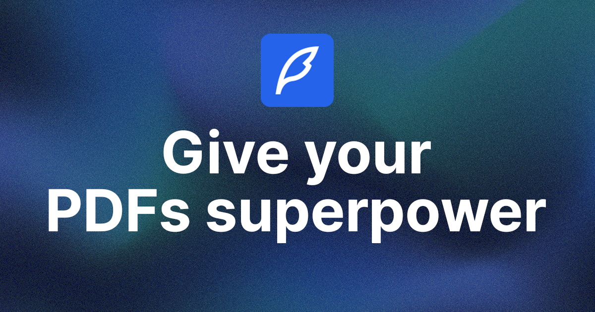

# Cerebro

Cerebro is a complete Software as a Service (SaaS) platform developed by Laksh Kundnani. This project is built from scratch using Next.js 13, React, Prisma, tRPC, Tailwind, and other cutting-edge technologies. It serves as a comprehensive example of building a modern SaaS application with a rich feature set.

## Features

- **Complete SaaS Platform**: Fully functional SaaS application built from the ground up.
- **Beautiful UI**: Professionally designed landing and pricing pages included for a modern and clean user interface.
- **Authentication Using Kinde**: Secure user authentication powered by Kinde.
- **Subscription Plans**: Free and Pro plans integrated with Stripe for seamless payment processing.
- **Infinite Message Loading**: Optimized for performance with infinite message loading.
- **PDF Viewer**: A beautiful and highly functional PDF viewer for enhanced document viewing.
- **Real-Time Streaming API**: Receive real-time updates with streaming API responses.
- **Optimistic UI Updates**: Enhance user experience with optimistic UI updates.
- **Drag n’ Drop Uploads**: Intuitive file uploads with drag-and-drop functionality.
- **Instant Loading States**: Achieve instant loading states for a seamless user experience.
- **Modern Data Fetching**: Utilize tRPC and Zod for modern and efficient data fetching.
- **AI Memory with LangChain**: Leverage LangChain for infinite AI memory.
- **Vector Storage with Pinecone**: Efficient vector storage using Pinecone.
- **ORM with Prisma**: Database interactions powered by Prisma.
- **100% TypeScript**: The entire project is written in TypeScript for type safety.

...and much more!

## Getting Started

Clone the repository and follow the project videos for a detailed walkthrough of Cerebro's development process.

## Author

- **Laksh Kundnani**
  - GitHub: [https://github.com/kundnanl](https://github.com/kundnanl)

## Contributing

Feel free to contribute, open issues, or provide feedback to make Cerebro even better!
